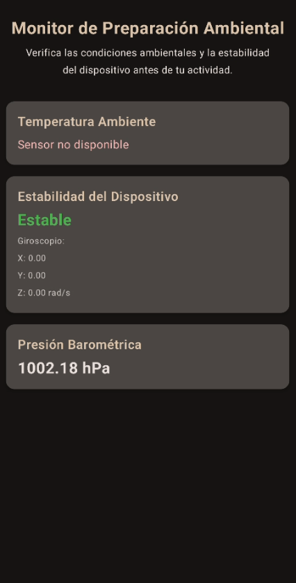

<h1 align="center">
  Android: Monitor de Preparación Ambiental
</h1>
<a name="readme-top"></a>

<h4 align="center">
  Aplicación Android para monitorear la temperatura ambiente, datos del giroscopio (incluyendo estabilidad) y presión barométrica.<br>
  Desarrollada en Kotlin con Jetpack Compose.
</h4>


####  Para Fines Educativos y Demostración del Uso de Sensores en Android


<h2 align="center">Descripción del Proyecto</h2>

<p align="center">
  Este proyecto es una aplicación para Android desarrollada en Kotlin y Jetpack Compose que demuestra cómo acceder y mostrar datos de múltiples sensores del dispositivo: temperatura ambiente, giroscopio y sensor de presión barométrica. La aplicación no solo muestra los valores crudos, sino que también calcula e indica la estabilidad del dispositivo basándose en las lecturas del giroscopio. Se implementa una lógica de fallback para el sensor de temperatura ambiente, intentando primero el sensor estándar <code>TYPE_AMBIENT_TEMPERATURE</code> y, si no está disponible, buscando sensores de temperatura conocidos por su nombre (como "ICP10101" o "LSM6DSR") para proveer una lectura en dispositivos específicos como el Google Pixel 6 Pro.
</p>

<p align="center">
  
  </p>

<h3 align="center">Creado/Adaptado por:</h3>
<p align="center">
  <a href="https://github.com/gabiru05">gabiru05</a>
</p>


<h2 align="center">Características Principales</h2>

<ul>
  <li> <strong>Lectura de Temperatura Ambiente:</strong> Intenta obtener la temperatura del sensor estándar y, como fallback, busca sensores específicos por nombre. Muestra qué sensor se está utilizando.</li>
  <li> <strong>Datos del Giroscopio:</strong> Visualiza los valores crudos de velocidad angular (X, Y, Z).</li>
  <li> <strong>Indicador de Estabilidad:</strong> Calcula e indica si el dispositivo está "Estable" o "Inestable" basándose en la magnitud de la velocidad angular del giroscopio.</li>
  <li> <strong>Lectura de Presión Barométrica:</strong> Muestra la presión atmosférica actual en hPa.</li>
  <li> <strong>Verificación de Disponibilidad:</strong> Indica si alguno de los sensores no está disponible en el dispositivo.</li>
  <li> <strong>Interfaz Moderna:</strong> Desarrollada con Jetpack Compose y Material 3 para una experiencia de usuario limpia.</li>
  <li> <strong>Desarrollo en Kotlin:</strong> Código moderno y conciso utilizando las últimas prácticas de desarrollo Android.</li>
  <li> <strong>ViewModel Architecture:</strong> Utiliza ViewModel para manejar la lógica de los sensores y el estado de la UI.</li>
</ul>


<h2 align="center">Estructura del Proyecto (Simplificada)</h2>

<p align="center">
  El proyecto sigue una estructura típica de una aplicación Android con Kotlin y Jetpack Compose:
</p>

-   `app/`: Módulo principal de la aplicación.
    -   `src/main/`: Contiene el código fuente y los recursos.
        -   `java/com/example/ambientprepmonitor/` (o tu paquete principal): Código Kotlin.
            -   `MainActivity.kt`: Actividad principal, configura la UI de Compose (`AmbientPrepScreen`, `SensorInfoCard`).
            -   `SensorViewModel.kt`: Gestiona la lógica de acceso a los sensores (SensorManager), actualiza los estados (temperatura, giroscopio, presión, estabilidad) y maneja la lógica de fallback para el sensor de temperatura.
            -   `ui/theme/`: Archivos generados por Android Studio para el tema de Compose (`Color.kt`, `Theme.kt`, `Type.kt`).
        -   `AndroidManifest.xml`: Define las características de hardware utilizadas (`<uses-feature>` para los sensores de temperatura, giroscopio y barómetro).
    -   `build.gradle` o `build.gradle.kts` (Module :app): Script de configuración de Gradle con las dependencias (Compose, ViewModel, Lifecycle, Kotlin).


<h2 align="center">Tecnologías Utilizadas</h2>

<ul>
  <li> <strong>Kotlin:</strong> Lenguaje de programación principal.</li>
  <li> <strong>Jetpack Compose:</strong> Toolkit moderno para construir interfaces de usuario nativas en Android.</li>
  <li> <strong>Android SDK:</strong> Para el desarrollo de aplicaciones nativas Android.</li>
  <li><strong>Android SensorManager API:</strong> Para interactuar con los sensores del dispositivo.</li>
  <li><strong>ViewModel (Android Jetpack):</strong> Para gestionar datos relacionados con la UI de forma consciente del ciclo de vida.</li>
  <li><strong>Material 3 Components:</strong> Para los elementos de la interfaz de usuario.</li>
  <li> <strong>Android Studio:</strong> Entorno de Desarrollo Integrado (IDE) oficial.</li>
  <li><strong>Gradle:</strong> Para la gestión de dependencias y construcción del proyecto.</li>
</ul>


<h2 align="center">Instalación y Uso</h2>

1.  **Clonar el repositorio:**
    ```bash
    git clone [https://github.com/gabiru05/kotlin-environmental-sensor-app.git](https://github.com/gabiru05/kotlin-environmental-sensor-app.git)
    cd kotlin-environmental-sensor-app
    ```

2.  **Abrir en Android Studio:**
    * Abre Android Studio.
    * Selecciona `File > Open...` o "Open an Existing Project".
    * Navega y selecciona la carpeta `kotlin-environmental-sensor-app` clonada.
    * Espera a que Android Studio configure el proyecto y sincronice Gradle.

3.  **Ejecutar la aplicación:**
    * Conecta un dispositivo Android con los sensores requeridos (ej. Google Pixel 6 Pro o similar) o inicia un Emulador que permita simular estos sensores (la simulación de temperatura ambiente específica puede ser limitada en emuladores).
    * Selecciona el dispositivo/emulador en Android Studio.
    * Haz clic en el botón "Run 'app'" (▶️).

4.  **Cómo Usar:**
    * La aplicación mostrará el título "Monitor de Preparación Ambiental" y una breve descripción.
    * Se presentarán tarjetas para:
        * **Temperatura:** Mostrará la lectura y el nombre del sensor utilizado (ej. "(ICP10101 Temperature)" o "(Estándar)"). Si no se encuentra ningún sensor de temperatura adecuado, indicará "Sensor no disponible".
        * **Estabilidad del Dispositivo:** Indicará "Estable", "Inestable" o "Analizando..." basado en los movimientos detectados por el giroscopio. También mostrará los valores crudos X, Y, Z del giroscopio.
        * **Presión Barométrica:** Mostrará la presión atmosférica actual.
    * La información se actualiza en tiempo real.


<p align="right"><a href="#readme-top">Volver arriba</a></p>